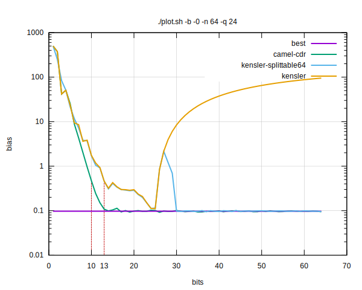
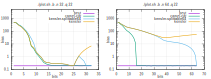

# Improving Andrew Kensler's permute():
## A function for stateless, constant-time pseudorandom-order array iteration

I recently came across a rather fascinating [blog post](https://andrew-helmer.github.io/permute/) from Andrew Helmer.
It explains the permute() function, introduced in a [paper](https://graphics.pixar.com/library/MultiJitteredSampling/paper.pdf) written by Andrew Kensler.

I really recommend that you quickly take the time to read this [blog post](https://andrew-helmer.github.io/permute/), but I'll give a quick summary of it here anyways:

permute() is a stateless and constant-time function that generates unique pseudorandom permutations for a given seed. It works using a hash function that is invertible for a given power-of-two size domain, which implies that there is a one to one mapping for all numbers in the range `[0:(2^n)-1]`. This means that if you pass any number in the range `[0:(2^n)-1]` to the hash function it will always return a unique number that is also in the same range. To get this to work with arbitrary ranges, we can use so-called "cycle walking", which entails rounding up our desired range to the next power-of-two and discarding every number that isn't within the range.

I already knew of two other similar algorithms, using a [weyl sequence](https://en.wikipedia.org/wiki/Weyl_sequence) or a [LCG](https://en.wikipedia.org/wiki/Linear_congruential_generator) with a modulo of the next power-of-two, but those approaches aren't very random and the underlying generators very easily fail statistical testing.
This is where I wasn't satisfied with the information from the paper, as they never supplied any measurements of the quality of randomness. They only said that they found a hash function with good avalanche properties and that they had good results with ranges up to `2^27`.

Luckily you should be able to make invertible hash functions as high quality as you want to, by just adding more and more operations, so I set out to test the randomness of the original hash function.
I also wanted to find a suitable 64-bit hash function since the advantages of using something like permute() are bigger with larger ranges.


### A better (64-bit) function

Before I go over how the testing was done I'm going to quickly present my new and improved hash function, so we can directly look at the test results later.

I started out with Kensler's original hash functions and tried to improve on it, by adding other well known high-quality invertible integer hash functions.

<details>
<summary>kensler.c</summary>
<p>

```c
uint32_t
hash(uint32_t idx, uint32_t mask, uint32_t seed)
{
	/* From Andrew Kensler: "Correlated Multi-Jittered Sampling" */
	idx ^= seed; idx *= 0xe170893d;
	idx ^= seed >> 16;
	idx ^= (idx & mask) >> 4;
	idx ^= seed >> 8; idx *= 0x0929eb3f;
	idx ^= seed >> 23;
	idx ^= (idx & mask) >> 1; idx *= 1 | seed >> 27;
	idx *= 0x6935fa69;
	idx ^= (idx & mask) >> 11; idx *= 0x74dcb303;
	idx ^= (idx & mask) >> 2; idx *= 0x9e501cc3;
	idx ^= (idx & mask) >> 2; idx *= 0xc860a3df;
	idx &= mask;
	idx ^= idx >> 5;
	return (idx ^ seed) & mask;
}
```

</p>
</details>

As a baseline, for testing, I used the original 32-bit hash and a 64-bit hash, that combines the original with an adapted version of the well known 64-bit hash function `splittable64`.

<details>
<summary>kensler-splittable64.c</summary>
<p>

```c
uint64_t
hash(uint64_t idx, uint64_t mask, uint64_t seed)
{
	idx ^= seed;
	/* splittable64 */
	idx ^= (idx & mask) >> 30; idx *= UINT64_C(0xBF58476D1CE4E5B9);
	idx ^= (idx & mask) >> 27; idx *= UINT64_C(0x94D049BB133111EB);
	idx ^= (idx & mask) >> 31;
	idx *= UINT64_C(0xBF58476D1CE4E5B9);

	/* From Andrew Kensler: "Correlated Multi-Jittered Sampling" */
	idx ^= seed; idx *= 0xe170893d;
	idx ^= seed >> 16;
	idx ^= (idx & mask) >> 4;
	idx ^= seed >> 8; idx *= 0x0929eb3f;
	idx ^= seed >> 23;
	idx ^= (idx & mask) >> 1; idx *= 1 | seed >> 27;
	idx *= 0x6935fa69;
	idx ^= (idx & mask) >> 11; idx *= 0x74dcb303;
	idx ^= (idx & mask) >> 2; idx *= 0x9e501cc3;
	idx ^= (idx & mask) >> 2; idx *= 0xc860a3df;
	idx &= mask;
	idx ^= idx >> 5;
	return idx;
}
```

</p>
</details>

Then I used the tests below to evaluate different combinations of hash functions, which culminated in the following hash function:

<details>
<summary>camel-cdr.c</summary>
<p>

```c
uint64_t
hash(uint64_t idx, uint64_t mask, uint64_t seed)
{
	idx ^= seed;
	/* splittable64 */
	idx ^= (idx & mask) >> 30; idx *= UINT64_C(0xBF58476D1CE4E5B9);
	idx ^= (idx & mask) >> 27; idx *= UINT64_C(0x94D049BB133111EB);
	idx ^= (idx & mask) >> 31;
	idx *= UINT64_C(0xBF58476D1CE4E5B9);

	idx ^= seed >> 32;
	idx *= UINT32_C(0xED5AD4BB);

	idx ^= seed >> 48;
	/* hash16_xm3 */
	idx ^= (idx & mask) >> 7; idx *= 0x2993u;
	idx ^= (idx & mask) >> 5; idx *= 0xE877u;
	idx ^= (idx & mask) >> 9; idx *= 0x0235u;
	idx ^= idx >> 10;

	/* From Andrew Kensler: "Correlated Multi-Jittered Sampling" */
	idx ^= seed; idx *= 0xe170893d;
	idx ^= seed >> 16;
	idx ^= (idx & mask) >> 4;
	idx ^= seed >> 8; idx *= 0x0929eb3f;
	idx ^= seed >> 23;
	idx ^= (idx & mask) >> 1; idx *= 1 | seed >> 27;
	idx *= 0x6935fa69;
	idx ^= (idx & mask) >> 11; idx *= 0x74dcb303;
	idx ^= (idx & mask) >> 2; idx *= 0x9e501cc3;
	idx ^= (idx & mask) >> 2; idx *= 0xc860a3df;
	idx &= mask;
	idx ^= idx >> 5;

	return idx;
}

```

</p>
</details>


### Testing possible hash functions

We can safely ignore the cycle walking when testing the randomness of permutations. If a power-of-two permutation is stably random rejecting values from it won't make it less random. In the following, we'll thus only talk about power-of-two ranges.


#### Using a PractRand

The best way to test anything related to pseudorandom number generation is to use one of the existing statistical test suites. I'm using the PractRand test suite since it has high-quality tests and has a nice commanding interface.
Such test suites take the output of an RNG as input, and they then try to find statistical correlations in the generated numbers.

We can't just output the generated indices directly, since those are always unique for a range. This would lead to correlations since once a number occurs it doesn't occur again until all numbers in the range were generated and this could/should be picked up by the test suite.
To circumvent this we can create an array of random elements, sort this array and then output a random permutation of the sorted array. The original approach of outputting the indices directly would be equivalent to indexing an array that contains consecutive numbers from `0` to `n`. The initial random initialization of the elements removes the bias we had earlier. Note that the elements of the array should have a smaller range than the size of the array, hence we'll be an array of bytes.

`PractRand` evaluates the quality for every power-of-two bytes of input bytes separately.
I recorded on which, if any, power-of-two each hash function failed a test and ran each hash function with a powers-of-two against `PractRand stdin8 -tf 2 -te 1`. The seeds were randomly initialized, so this does reflect the hash quality of the index but doesn't properly test how good the seed is integrated into the hash.

| range [0:(2^n)-1]    | 4   | 5   | 6   | 7   | 8   | 9   | 10  | 11  | 12  | 13  | 14  |
| --------------------:| ---:| ---:| ---:| ---:| ---:| ---:| ---:| ---:| ---:| ---:| ---:|
| kensler              | 19  | 19  | 20  | 24  | 25  | 26  | 27  | 30  | 32  | >34 |     |
| kensler-splittable64 | 16  | 17  | 21  | 21  | 22  | 26  | 28  | 28  | 32  |  33 | >34 |
| camel-cdr            | 16  | 17  | 23  | 29  | 30  | 32  | >34 |     |     |     |     |

Although it initially fails a bit earlier my new hash function `camel-cdr` reaches the point, where I couldn't run the test any longer and no defects could be detected, earlier.
This is already quite nice, but I wasn't able to test the larger ranges, since detecting defects through this method takes way too long.


#### By calculating the hash bias

Fortunately, there there is another way to evaluate the randomness: By calculating the bias of the hash function.

While searching for high-quality invertible hash functions that I could combine to create a better power-of-two invertible hash function, I stumbled across another awesome [blog post](https://nullprogram.com/blog/2018/07/31/) and the corresponding [git repo](https://github.com/skeeto/hash-prospector).
It is about randomly generating new hash functions and evaluating them to find hashes with a low bias.

The part I was especially interested in is the way the bias is calculated.
The underlying idea is that flipping a single bit in the input should flip on average 50% of the output bits.
This can be evaluated by generating a bunch of random inputs, independently flipping every single input bit and counting the average number of bits that were different between the original output and the one from the input where one bit was flipped.
To get this to work with the hash functions we are interested in one can also thread the seed as an input and use the same algorithm for every power of two supported by the hash.

I've generated a bunch of graphs comparing the bias from the hash functions with the theoretical bias limit below.
The [blog post](https://nullprogram.com/blog/2018/07/31/) didn't include the method of how the theoretical bias limit is calculated and only offered the limit for 32-bit hash functions.
Doing the calculations on my own, I came to the conclusion, that the bias limit from the blog is wrong. I empirically verified this and created an [issue](https://github.com/skeeto/hash-prospector/issues/12) that proposes a working way to calculate the bias. I won't go into more detail about this here, but note that the biases calculated here can't be directly compared to the ones from the [blog post](https://nullprogram.com/blog/2018/07/31/).

But now let's have a look at the graphs.
The first one was generated by flipping the input bits and using a fixed random seed, to mimic what the PractRand test measured.



(Generated using `./plot.sh -o 0n64q24.svg -b -0 -n 64 -q 24 candidates/camel-cdr.so candidates/kensler-splittable64.so candidates/kensler.so`)

These results confirm the PractRand test results, in which my hash function passed all test with `2^24` bytes of output at a range of 2^10, the original `kensler` at 2^13 and `kensler-splittable64` at 2^14.
This roughly matches the gap between the graphs marked above.

Ideally, we'd like all seed bits to directly influence the output, so I also plotted the bias of flipping every seed bit in addition to every input bit.



(Generated using `./plot.sh -o n${i}q22.svg -b -n $i -q 22 candidates/camel-cdr.so candidates/kensler-splittable64.so candidates/kensler.so`)

For the first graph, only the first 32-bit of the seed were measured. This also confirms the claim from the [paper](https://graphics.pixar.com/library/MultiJitteredSampling/paper.pdf), that the quality degrades after `2^27`.
We further learn, that the degrading already starts at `2^25` and that the quality for ranges smaller than 2^15 isn't that good either. The optimal bias is only reached for ranges from `2^23` to `2^25`.
My proposed hash function also isn't perfect for smaller ranges, but it reaches the bias limit for ranges greater than `2^15` and the bias stays at the same level for all larger ranges. The second graph, for which all 64-bit of the seed were measured, shows that this trend continues to ranges up to `2^64`.
We can also see that the trivial 64-bit version of the original `kensler-splittable64` isn't very good at incorporating the upper seed bits and thus only reaches the bias limit at the `2^64` range.

So in conclusion the new hash function seems to have a good quality for ranges larger than `2^15`. This is actually exactly what we are looking for, because, as already mentioned, the advantages of using something like permute() are bigger with larger ranges.


### Performance comparisons

|                       | ns/hash   |
| ---------------------:| ---------:|
| kensler               | 4.761300  |
| kensler-splittable64  | 7.011112  |
| camel-cdr             | 11.332915 |


### A working code snippet

```c
#include <stdio.h>
#include <time.h>
#include <stdint.h>

typedef struct {
	uint64_t mask, len, seed;
} Permute64;

void
permute64_init(Permute64 *this, uint64_t len, uint64_t seed)
{
	uint64_t mask = len-1;
	mask |= mask >> 1;
	mask |= mask >> 2;
	mask |= mask >> 4;
	mask |= mask >> 8;
	mask |= mask >> 16;
	mask |= mask >> 32;
	this->mask = mask;
	this->len = len;
	this->seed = seed;
}

uint64_t
permute64(const Permute64 *this, uint64_t idx)
{
	const uint64_t mask = this->mask;
	const uint64_t len = this->len;
	const uint64_t seed = this->seed;
	do {
		idx ^= seed;
		/* splittable64 */
		idx ^= (idx & mask) >> 30; idx *= UINT64_C(0xBF58476D1CE4E5B9);
		idx ^= (idx & mask) >> 27; idx *= UINT64_C(0x94D049BB133111EB);
		idx ^= (idx & mask) >> 31;
		idx *= UINT64_C(0xBF58476D1CE4E5B9);

		idx ^= seed >> 32;
		idx &= mask;
		idx *= UINT32_C(0xED5AD4BB);

		idx ^= seed >> 48;
		///* hash16_xm3 */
		idx ^= (idx & mask) >> 7; idx *= 0x2993u;
		idx ^= (idx & mask) >> 5; idx *= 0xE877u;
		idx ^= (idx & mask) >> 9; idx *= 0x0235u;
		idx ^= (idx & mask) >> 10;

		/* From Andrew Kensler: "Correlated Multi-Jittered Sampling" */
		idx ^= seed; idx *= 0xe170893d;
		idx ^= seed >> 16;
		idx ^= (idx & mask) >> 4;
		idx ^= seed >> 8; idx *= 0x0929eb3f;
		idx ^= seed >> 23;
		idx ^= (idx & mask) >> 1; idx *= 1 | seed >> 27;
		idx *= 0x6935fa69;
		idx ^= (idx & mask) >> 11; idx *= 0x74dcb303;
		idx ^= (idx & mask) >> 2; idx *= 0x9e501cc3;
		idx ^= (idx & mask) >> 2; idx *= 0xc860a3df;
		idx &= mask;
		idx ^= idx >> 5;
	} while (idx >= len);
	return idx;
}

int
main(void)
{
	Permute64 p;
	permute64_init(&p, 10, 0x5eeda628748fc822 + time(0));

	for (uint64_t i = 0; i < 10; ++i) {
		printf("%llu\n", permute64(&p, i));
	}
}
```

